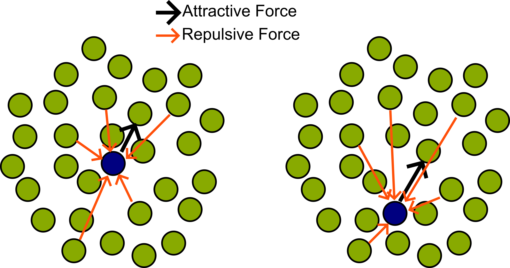

# Improving Out-of-Sample Embedding in UMAP

Fig: Focces on an out of sample test point (blue). (LEFT) When the point is in the interior of the cluster the negative samples often surround the test point. Thus the overall forces balance each other. (RIGHT) When the point is near the periphery of the cluster, the negative samples often provide an overall directional force that may cause the test point to be pushed to the periphery of the cluster, resulting in what we call `repulsion effect'.

Due to repulsion effect, UMAP has trouble adding new out-of-sample points to a pre-existing mapping. In particular, UMAP often places new points in the periphery of the found clusters, rather than the interior with their correlated neighbors. Here, we analyze the effect of repulsion on three different datasets: MNIST, Pneumonia, and Clinical Data. We overcome this ``repulsion effect'' by optimizing pairwise interactions within the original k-nearest-neighbor graph. Moreover, we show that parameterizing UMAP obtains better embeddings than non-parametric algorithms, particularly as the data get more complex (e.g. medical images). We also show that the repulsion effect is naturally mitigated when parameterized UMAP is employed to embed the data. We characterize different UMAP approaches using a range of metrics, including trustworthiness, nearest neighbor classifier error, accumulation count, and analysis of the attractive and repulsive forces in the embeddings.

This repository contains the code of our paper:

Mohammad Tariqul Islam, Jason W. Fleischer, "Improving Out-of-sample Embedding in UMAP", preprint
